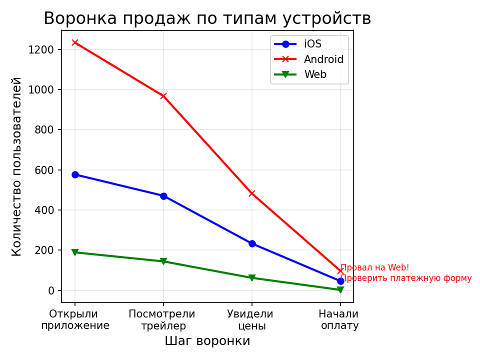

# 🎬 Анализ воронки продаж кино-онлайн сервиса

## 📌 Описание проекта

Анализ поведения 2 000 пользователей в воронке продаж: от открытия приложения до начала оплаты.

**Ключевая задача:** Выявить узкие места в воронке и предложить конкретные действия для увеличения конверсии.

**Результат:** Обнаружена критическая проблема на Web-платформе (конверсия <2% против 7-8% на мобильных устройствах). Даны чёткие рекомендации для бизнеса.

**Инструменты:** Python (Pandas, NumPy, Matplotlib)

---

## 🧬 Данные

Сгенерирована таблица `users` (2000 записей) и `events` (действия пользователей).

**Параметры генерации:**
- Дата регистрации: февраль 2026 (случайный день)
- Устройства: iOS (30%), Android (60%), Web (10%)
- Шаги воронки: `cinema_open` → `trailer_watch` → `price_page` → `to_payment`

Конверсии между шагами моделировались с разными вероятностями для разных устройств.

---

## 🔍 Этапы анализа

1. **EDA:** Проверка пропусков, распределение устройств.
2. **Построение воронки:** Количество пользователей на каждом шаге.
3. **Расчёт конверсий:** Для iOS, Android и Web.
4. **Визуализация и выводы:** График с аннотацией проблемного места.

---

## 📊 Ключевые выводы

| Устройство | Конверсия (открытие → оплата) |
|------------|-------------------------------|
| iOS | 7.97% |
| Android | 7.86% |
| Web | **1.06%** |

**Главный инсайт:** Web-версия теряет пользователей на последнем шаге (переход к оплате). Платёжная форма или процесс оплаты на Web не работают должным образом.

---

## 💡 Рекомендации бизнесу

1. **🔧 Проверить платёжную форму на Web:** Возможны ошибки или несовместимость с браузерами.
2. **💳 Добавить альтернативные способы оплаты:** QR-код, СБП или оплата через мобильное приложение.
3. **🎯 Стимулировать переход в мобильное приложение:** Скидка при оплате через Android/iOS.

---

## 🖼️ Визуализации

### Воронка продаж по типам устройств


---

## 📁 Файлы в репозитории

| Файл | Описание |
|------|----------|
| `funnel_analysis.py` | Основной скрипт с анализом |
| `funnel_analysis.csv` | Сгенерированные данные (users + events) |
| `funnel_analysis.png` | Итоговый график воронки |
| `requirements.txt` | Список зависимостей |

---

## 🚀 Запуск проекта

1. Клонировать репозиторий:
   ```bash
   git clone https://github.com/dimaget26/conversion-cinema.git
